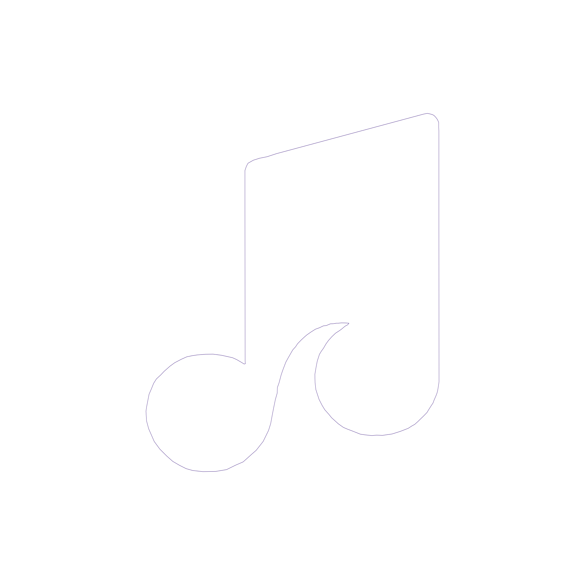

  

  <h1 align="center">Sekai Tune</h1>

  

    <strong>Redefining the YouTube Music Experience on Android.</strong>
     
    <em>It’s high-performance, privacy-focused, and packed with features for people who really care about their experience.</em>
  

## Recent Changes & Features

### 🎨 Branding & UI Overhaul
* **Custom Onboarding Experience:** Replaced the default startup badge with a custom, transparent Sekai Tune vector logo (`.xml`) for a cleaner first-install experience.
* **Streamlined Updater:** Redesigned the in-app update controls panel. Completely removed the "Canary" update channel to focus exclusively on standard releases, centering the "Stable" button for a more balanced UI.

**SekaiTune** isn’t just another generic YouTube Music wrapper. It’s a fully custom-built player made from the ground up, because we think your music should stay private, look clean, and work exactly the way you expect. If you care about sound quality and want something that actually feels good to use, this is it.

---

> [!IMPORTANT]  
> **Geographic Availability:** If YouTube Music is not supported in your region, a VPN or proxy set to a supported region is required for initial data fetching.

---

## 📸 Showcase

---

## ✨ Features

<table>
  <tr>
    <td width="50%" valign="top">
      

        <h3>Playback</h3>
        <ul>
          <li>Multiple account support with quick switching</li>
          <li>Ad-free playback with background listening</li>
          <li>Your playlists, liked songs, and subscriptions appear after sign-in</li>
          <li>Support local file and local song playback
          <li>Fast startup and lightweight performance</li>
          <li>Built for a private, uninterrupted listening experience</li>
        </ul>
      

    </td>
    <td width="50%" valign="top">
      

        <h3>Audio</h3>
        <ul>
          <li>EBU R128 loudness normalization</li>
          <li>Tempo, pitch, and playback speed controls</li>
          <li>Crossfade between tracks</li>
          <li>System equalizer and spatial audio integration</li>
        </ul>
      

    </td>
  </tr>
  <tr>
    <td width="50%" valign="top">
      

        <h3>Lyrics &amp; Discovery</h3>
        <ul>
          <li>Live synced lyrics</li>
          <li>Lyrics translation, AI Lyrics translation and romanization</li>
          <li>Music recognition for songs around you</li>
          <li>Listening statistics whenever you want them</li>
        </ul>
      

    </td>
    <td width="50%" valign="top">
      

        <h3>Sync &amp; Social</h3>
        <ul>
          <li>Import playlist from spotify</li>
          <li>YouTube Music account integration</li>
          <li>Last.fm scrobbling</li>
          <li>ListenBrainz history sync</li>
          <li>Discord rich presence support</li>
        </ul>
      

    </td>
  </tr>
  <tr>
    <td width="50%" valign="top">
      

        <h3>Interface</h3>
        <ul>
          <li>Material 3 design language</li>
          <li>Album-art powered dynamic colors</li>
          <li>Up to 9 different player styles</li>
          <li>Up to 8 different player background styles</li>
          <li>Responsive layouts for different screen sizes</li>
          <li>Clean browsing, player, artist, album, and lyrics views</li>
        </ul>
      

    </td>
    <td width="50%" valign="top">
      

        <h3>Customization</h3>
        <ul>
          <li>Deep playback and interface settings</li>
          <li>Dynamic color theming options</li>
          <li>Gesture customization</li>
          <li>Animation and layout tuning</li>
          <li>Flexible controls to shape the app around your workflow</li>
        </ul>
      

    </td>
  </tr>
</table>

---

## 📥 Download Now

> [!WARNING]  
> **Notes:** The trusted download source is listed above; we are not responsible for any risks you may encounter from downloading from other sources.

## ❓ Need Help or Have Questions?

### Open-Source Acknowledgments

SekaiTune is made possible by the work of many open-source projects and communities:

- **Metrolist** by [Mostafa Alagamy](https://github.com/mostafaalagamy/Metrolist) for the base framework.
- **SimpMusic** by [maxrave-dev](https://github.com/maxrave-dev/SimpMusic) for the lyrics API provider.
- [BetterLyrics](https://better-lyrics.boidu.dev/) for word-by-word lyrics, unison and artwork provider support.
- [Material Color Utilities](https://github.com/material-foundation/material-color-utilities)
- [Read You](https://github.com/Ashinch/ReadYou) and [Seal](https://github.com/JunkFood02/Seal) for UI component inspiration.
- Translators, beta testers, contributors, and community members who continue to support the project.

---

## ⚖️ Legal Disclaimer

SekaiTune is an independent third-party client.
- Not affiliated with Google LLC or YouTube.
- Does not bypass YouTube's technical protections.
- Users are encouraged to support artists by purchasing music via official channels.

---