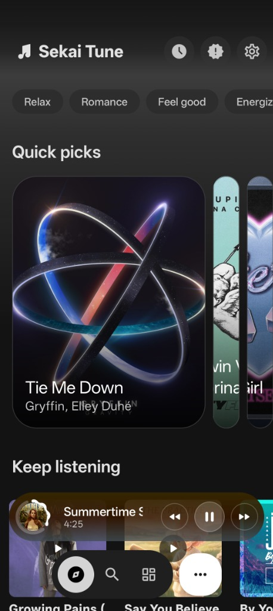
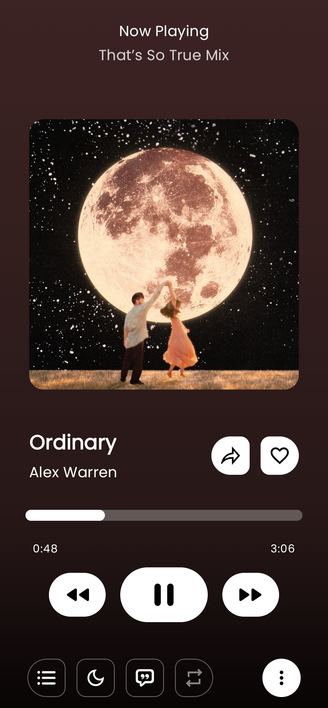
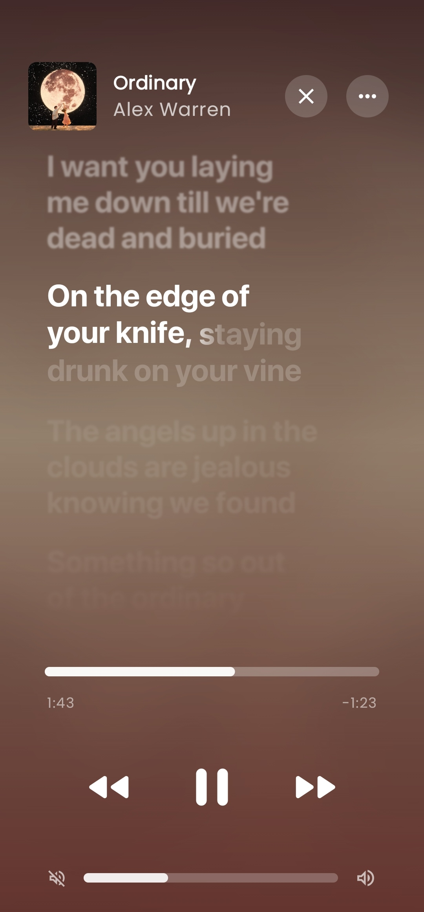
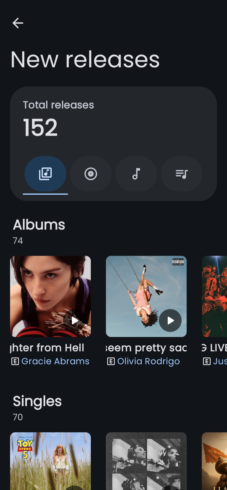
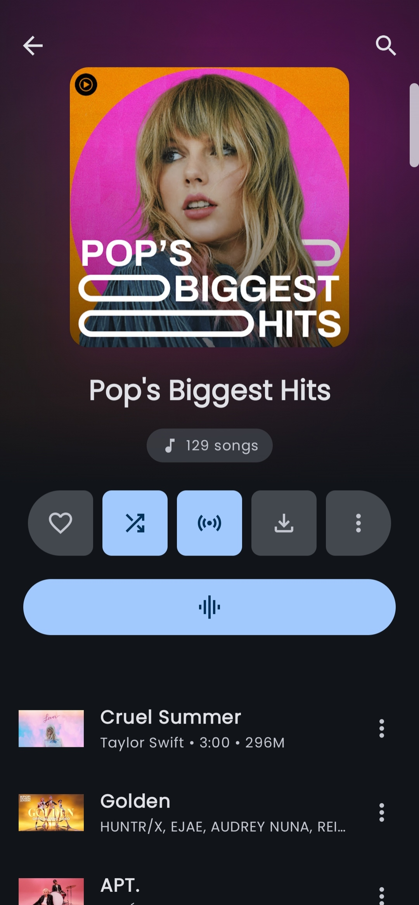
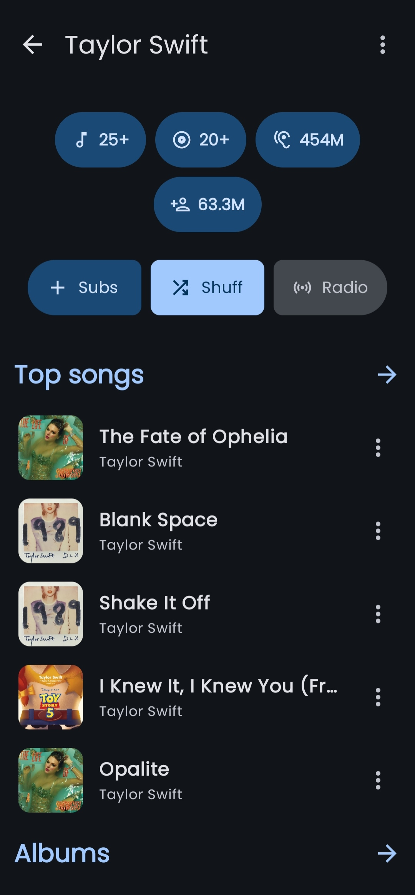
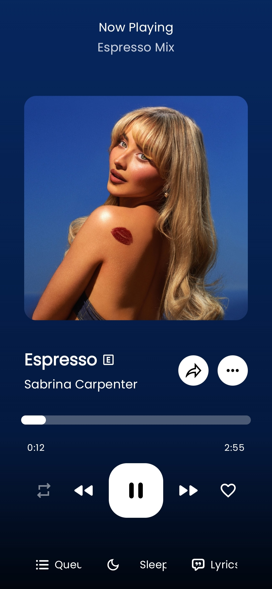
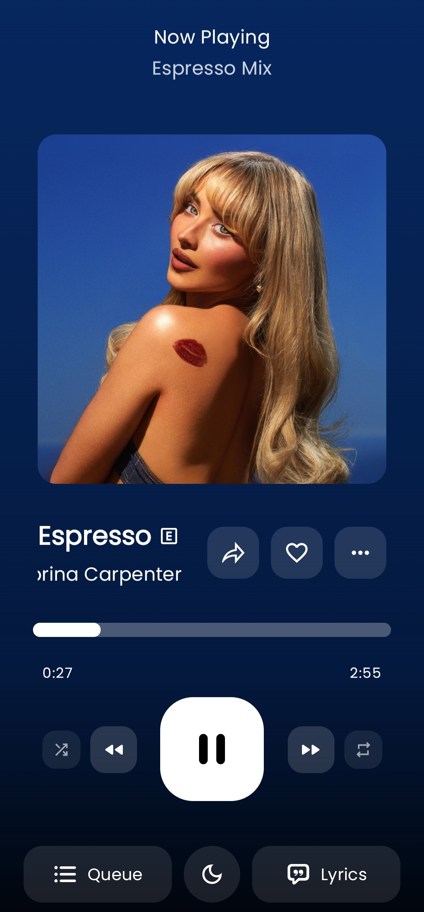
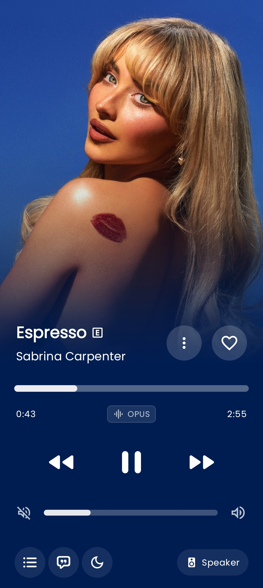

<div align="center">

  

  <h1>Sekai Tune</h1>

  <p>
    <a href="https://github.com/rgsekai/sekai-tune/releases/latest"></a>
    <a href="https://rgsekai.github.io/sekai-tune/"></a>
    <a href="https://github.com/rgsekai/sekai-tune/issues/new?template=bug_report.yml"></a>
    <a href="https://github.com/rgsekai/sekai-tune/issues/new?template=feature_request.yml"></a>
  </p>

  <p>
    <strong>Sekai Tune is an open-source, privacy-focused YouTube Music client for Android built with Jetpack Compose and Material 3 design.</strong>
    <br />
    <em>Enjoy fast, ad-free streaming, live synced lyrics, customizable audio effects, and rich personalization without tracking or bloat.</em>
  </p>

</div>

---

> [!IMPORTANT]  
> **Geographic Availability:** If YouTube Music is not supported in your region, a VPN or proxy set to a supported country is required for initial catalog browsing and playback.

---

## 📥 Download

<p align="center">
  <a href="https://github.com/rgsekai/sekai-tune/releases/latest"></a>
</p>

When installing the APK, Android may display a Google Play Protect prompt stating *"App scan recommended"* for apps installed outside the Play Store; tapping **"Scan app"** is completely normal.

> [!WARNING]  
> **Note:** The official repository releases above are the only trusted download source. We are not responsible for any modified or unofficial packages distributed elsewhere.

---

<details>
<summary><b>📸 Screenshots (Click to Expand)</b></summary>

<br>

<div align="center">

  
  
  
  
  
  
  
  
  

</div>

</details>

---

## ✨ Features

<details>
<summary><b>🎵 Playback &amp; Library</b></summary>

- **Ad-free Audio Streaming:** Background playback, streaming cache, and persistent audio queues.
- **YouTube Music Integration:** Sign in to sync your playlists, subscriptions, history, and liked songs.
- **Local Audio Support:** Seamless playback for local audio files and offline downloaded tracks.
- **Multi-Account Support:** Switch between multiple accounts quickly without data loss.
- **Lightweight & Fast:** Snappy startup and low memory footprint.

</details>

<details>
<summary><b>🎛️ Audio Controls &amp; DSP</b></summary>

- **Loudness Normalization:** Built-in EBU R128 volume matching across all tracks.
- **Playback Tuning:** Adjust tempo, pitch, and playback speed in real time.
- **Crossfading:** Smooth audio transitions between consecutive songs.
- **System DSP:** Integrated system equalizer intents and spatial audio support.

</details>

<details>
<summary><b>🎤 Lyrics &amp; Music Discovery</b></summary>

- **Live Synced Lyrics:** Line-by-line and word-by-word synced lyrics powered by BetterLyrics, LrcLib, KuGou, and SimpMusic.
- **AI Translation &amp; Romanization:** Instant translation and romanization for non-native lyrics.
- **Music Recognition:** Identify songs playing nearby with integrated Shazam recognition (no raw audio uploaded).
- **Listening Statistics:** In-depth playback analytics, top tracks, and history logs.

</details>

<details>
<summary><b>👥 Together Online &amp; Social</b></summary>

- **Together Online:** Host or join shared listening rooms with friends in real time.
- **Buddy List:** Add friends directly from sessions and send room invites with push notifications.
- **Spotify Library Import:** Import playlists and followed artists from your Spotify account.
- **Animated Canvas:** Rich animated video canvas artwork from Spotify, Apple Music, and TIDAL.

</details>

<details>
<summary><b>🎨 Interface &amp; Theming</b></summary>

- **Material 3 Design:** Full Material You theme with dynamic colors extracted from active album artwork.
- **Liquid Glass Theme:** Real-time customizable frosted glass surfaces, depth blur, and chromatic refraction.
- **Player Customization:** 9 player layouts and 8 customizable player background styles.
- **Responsive UI:** Tailored views for phones, foldable devices, and tablets.

</details>

<details>
<summary><b>⚙️ Customization &amp; Widgets</b></summary>

- **Playback Widgets:** Clean Material 3 and Liquid Glass widgets for your home screen.
- **Gesture Controls:** Customizable swipe actions and quick controls.
- **Local Backup &amp; Restore:** Export and import full library and settings backups as a local ZIP file.
- **In-App Updater:** Automated release checking and seamless direct updates.

</details>

---

<details>
<summary><b>🛠️ Building from Source</b></summary>

<br>

### Prerequisites
- **JDK 21** (e.g. Eclipse Temurin or OpenJDK 21)
- **Android SDK** with platform tools (compileSdk 37, minSdk 26)
- **Android Studio Ladybug / Meerkat** or newer (optional)

### Build Commands
Clone the repository and compile using Gradle:

```bash
# Clone the repository
git clone https://github.com/rgsekai/sekai-tune.git
cd sekai-tune

# Build universal release APK (GMS variant)
./gradlew assembleGmsMobileUniversalRelease

# Build ARM64 release APK (GMS variant)
./gradlew assembleGmsMobileArm64Release

# Build FOSS universal release APK (Google-free variant)
./gradlew assembleFossMobileUniversalRelease
```

> [!NOTE]  
> Firebase features (Together Online and Buddy List) require `google-services.json` in the `app/` directory. Push notifications and session invitations rely on the optional relay configuration (`RELAY_SERVICE_URL` and `RELAY_SERVICE_API_KEY` in `local.properties` or environment variables).

</details>

---

## 🔒 Privacy

<p align="left">
  <a href="PRIVACY.md"></a>
</p>

Sekai Tune is built with privacy as a foundational principle:
- Most core app data (library, playback history, settings, and credentials) remains strictly on your device with zero telemetry or third-party analytics.
- Google Firebase is used strictly for online real-time features (Together Online, display name, profile picture, and Buddy List); your app settings, API keys, and account sessions stay local and are never uploaded to Firebase.

For complete details on data handling and external endpoints, read our [Privacy Notice](PRIVACY.md).

---

## 💖 Support the Project

Sekai Tune is free, open-source software developed in personal time. If you enjoy the app and want to support ongoing maintenance:

<div align="left">
  <table>
    <tr>
      <td>
        <a href="https://buymeacoffee.com/rgsekai"></a>
      </td>
    </tr>
  </table>
</div>

<details>
<summary><b>💳 UPI Payment Details (India)</b></summary>

<br>

You can copy and send support directly via UPI:

```text
rgsekai@upi
```

*Note: In the Sekai Tune Android app, tapping the UPI entry under **Settings → Support** opens your installed payment app directly.*

</details>

---

<details>
<summary><b>📜 Open-Source Acknowledgments</b></summary>

<br>

Sekai Tune is built on the shoulders of the open-source community:

* **[ArchiveTune](https://github.com/ArchiveTune/ArchiveTune)** & **[InnerTune](https://github.com/z-huang/InnerTune)** — The foundational upstream music player architecture this app is forked and developed from.
* **[Echo Music](https://github.com/brahmkshatriya/echo)** — Design and feature inspiration.
* **[SimpMusic](https://github.com/maxrave-dev/SimpMusic)** — Lyrics API provider implementation.
* **[BetterLyrics](https://github.com/BetterLyrics/BetterLyrics)** — Word-by-word synced lyrics, unison, and artwork integration.
* **[Material Color Utilities](https://github.com/material-foundation/material-color-utilities)** — Dynamic theming extraction.
* **[Read You](https://github.com/Ashinch/ReadYou)** and **[Seal](https://github.com/JunkFood02/Seal)** — UI component design inspiration.
* **Translators, beta testers, and contributors** who continue to test, translate, and improve Sekai Tune.

</details>

---

## 📄 License

<p align="left">
  <a href="LICENSE"></a>
</p>

This project is licensed under the **GNU General Public License v3.0** (GPL-3.0). See the [LICENSE](LICENSE) file for complete license terms.

---

## ⚖️ Legal Disclaimer

Sekai Tune is an independent, third-party client.
- It is **not** affiliated with, endorsed by, or sponsored by Google LLC or YouTube.
- It does not bypass YouTube's technical copy protections.
- Users are encouraged to support artists by purchasing music and subscriptions through official channels.